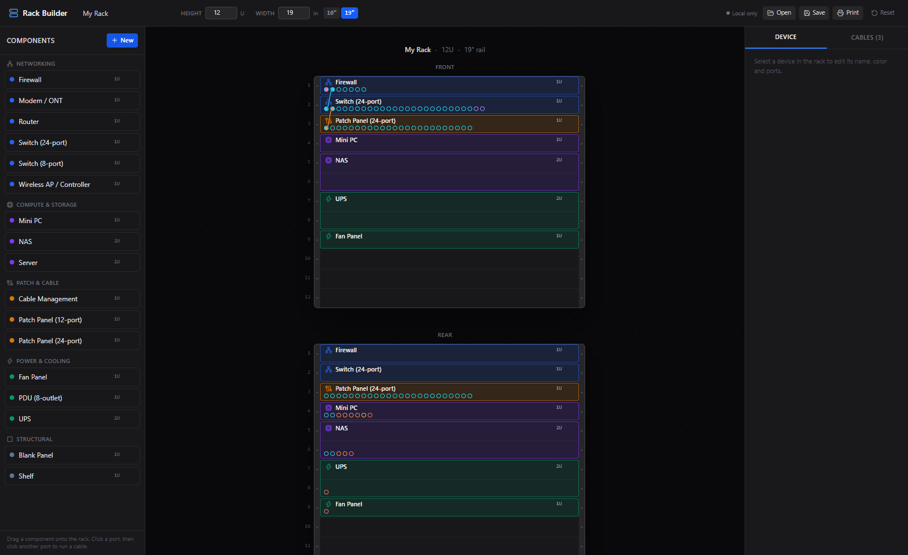

# Rack Builder

A visual server rack planner and cabling documentation tool. Pick a rack height and width, drag components in from a modular parts library, and wire up ports between devices (or out to things outside the rack, like a wall jack or ISP line) by clicking one port and then another.



## Features

- **Configurable rack**: any height in U and any rail width in inches, with quick presets for 10" and 19".
- **Front and rear elevations, side by side**: mount a device once and see it in both views. A port can be set to `front`, `rear`, or `both` (handy for patch panels, where the front patch side and rear punch-down are the same physical position but can carry independent cabling).
- **Modular component library**: routers, switches, patch panels, mini PCs, servers, NAS, UPS, PDU, fans, and more, grouped by category and kept alphabetized. Duplicate any built-in as a starting point, or build a fully custom device (name, U height, color, and an arbitrary list of ports by label/type/side/count).
- **Click-to-wire cabling**: click a port, then click another port to run a cable; click a cable to remove it. Cables route as a smooth curve with a dark halo so they stay legible even when they cross other equipment.
- **External connections**: a port can terminate at a free-text label ("Wall jack, bedroom", "ISP fiber") instead of another rack port, for things that live outside the rack. Shown as a distinct fill color and a hover tooltip, not a cluttered line.
- **"In use" marking**: for ports where you don't care what's plugged in (a power outlet, say), mark it occupied without wiring it anywhere.
- **Save to a real file**: Save/Open write a plain `.json` config via the browser's file picker (falls back to download/upload where that API isn't available), so you can keep it in this repo, in git, wherever you like.
- **Print / PDF export**: a clean, ink-friendly table of mounted devices (by U position) and every cable, for printing or saving as a PDF.
- **Server-side persistence in Docker**: when run via the included server, the current config also auto-saves to a Docker volume, so the rack you built is there no matter which device you open it from.

## Local development

```bash
npm install
npm run dev
```

This starts a Vite dev server (default `http://localhost:5173`). State is kept in the browser's `localStorage` while you work.

## Running with Docker

The included `Dockerfile` builds the app and serves it from a small built-in Node server (`server.js`, no framework, just `node:http`) that does two things: serves the static build, and exposes a tiny API (`GET`/`PUT /api/config`) that the frontend uses to auto-save the current rack to disk.

### Quick start

```bash
docker compose up -d
```

Then open `http://localhost:8080`.

### `.env`

Copy `.env.example` to `.env` to customize the host port:

```env
# Host port that maps to the container's internal port (8080).
PORT=8080
```

There's nothing else to configure, this app has no external services, API keys, or secrets. `.env` only exists so you can change which host port it's exposed on without editing `docker-compose.yml`.

### Volumes

The container writes the current rack config to `/data/rack.json` inside the container. `docker-compose.yml` maps this to a named volume:

```yaml
volumes:
  rack-data:/data
```

This is what makes the rack you build persist across container restarts, redeploys, and image updates, and what lets you open the app from a different browser or device on your network and see the same rack (rather than each browser having its own separate `localStorage` copy). If the header shows "Local only" instead of "Synced", the app couldn't reach `/api/config` and is falling back to the browser's own storage; check that the container is actually running the bundled server, and not just serving `dist/` behind a plain static file host.

To back up your rack, copy `rack.json` out of the volume:

```bash
docker cp rack-builder:/data/rack.json ./rack-backup.json
```

### Ports

The container listens on `8080` internally (`PORT` env var inside the container). `docker-compose.yml` maps that to whatever host port you set in `.env` (default `8080`).

### Running without Compose

```bash
docker build -t rack-builder .
docker run -d --name rack-builder -p 8080:8080 -v rack-data:/data rack-builder
```

## Publishing an image on tag push

Pushing a version tag builds and publishes a multi-arch (`amd64`/`arm64`) image to the GitHub Container Registry, via [.github/workflows/docker-publish.yml](.github/workflows/docker-publish.yml):

```bash
git tag v1.0.0
git push origin v1.0.0
```

This publishes `ghcr.io/cvd-unmatched/rack:1.0.0`, `ghcr.io/cvd-unmatched/rack:1.0`, and `ghcr.io/cvd-unmatched/rack:latest`. No extra secrets are needed, it authenticates with the repo's built-in `GITHUB_TOKEN`.

**First time only:** GitHub Container Registry packages are private by default. After the first publish, open the package's settings on GitHub (from the repo sidebar, under "Packages") and change its visibility to public if you want to `docker pull` it without logging in first.

Once published, pull it from anywhere:

```bash
docker pull ghcr.io/cvd-unmatched/rack:latest
docker run -d --name rack-builder -p 8080:8080 -v rack-data:/data ghcr.io/cvd-unmatched/rack:latest
```

Or point `docker-compose.yml` at the published image instead of building locally, see the commented `image:` line at the top of the file.

## Tech stack

React + TypeScript + Vite, Tailwind CSS v4, Zustand for state (persisted to `localStorage`), no other UI framework. The production server is a ~100-line `node:http` script with zero dependencies.
